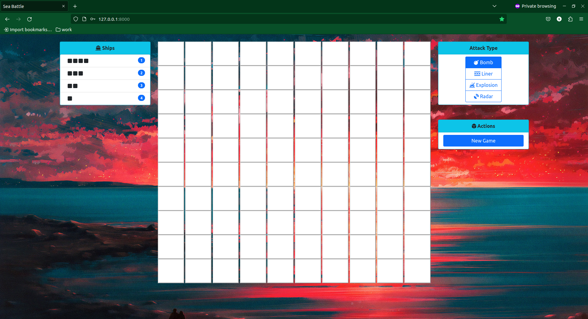
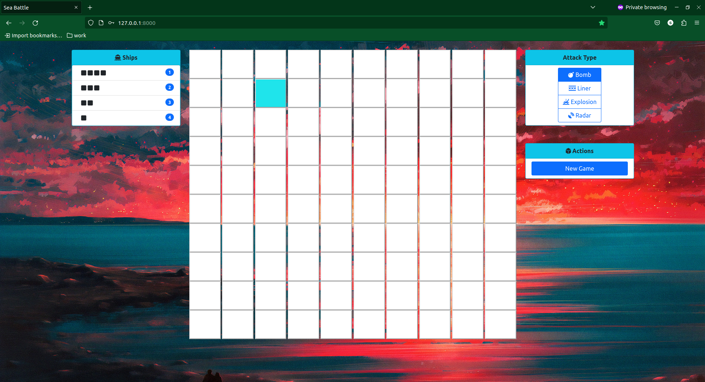
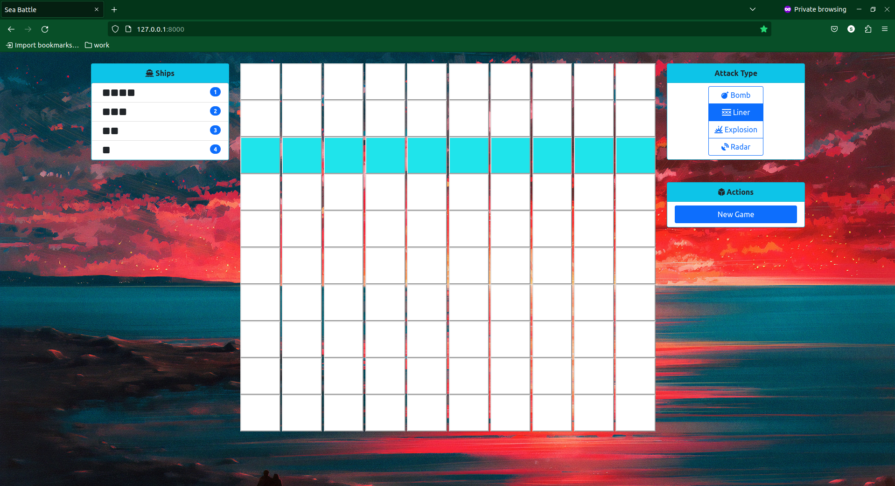

# sea
sea battle game by django





### Usage
I am using python "3.10.6" version 

first step clone my project
```
git clone https://github.com/sorooshm78/sea/
```

and then install requirements  
```
pip install -r requirements.txt
```

### Setup Redis Cache 
Install Redis on Linux 
```
sudo apt-get update
sudo apt-get install redis
```
Run the Redis server from a new terminal window.
```
redis-server
```
and you can change redis configurations in core/settings.py
```
# Cash setting
CACHES = {
    "default": {
        "BACKEND": "django_redis.cache.RedisCache",
        "LOCATION": "redis://127.0.0.1:6379/",
        "OPTIONS": {
            "CLIENT_CLASS": "django_redis.client.DefaultClient",
        },
    }
}
```

### Running the code 
Just go into the code directory and type 
```
python manage.py runserver
```
"sea battle game" app will start on 127.0.0.1:8000 (Local Address).
 
enjoy it!